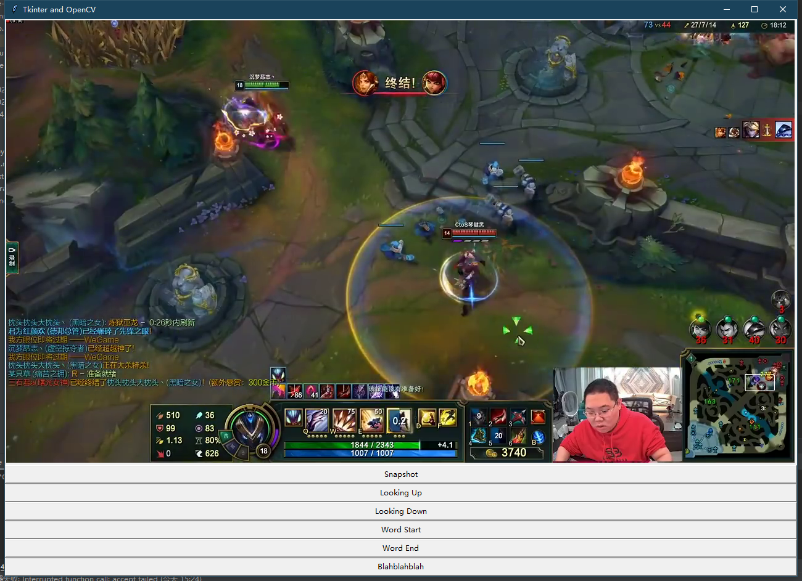

# Chek

 A simple GUI to count the lips and eye movement manually.

## How to use

- Fork this project and select the `picture.py` as the file to be compiled and executed.
- If things go well you may find a GUI like this:

     

- all the snapshots will be stored in the folder `res`.
- this GUI is just a prototype, if you are interested in it please help me make it better.

Kaki
May 13